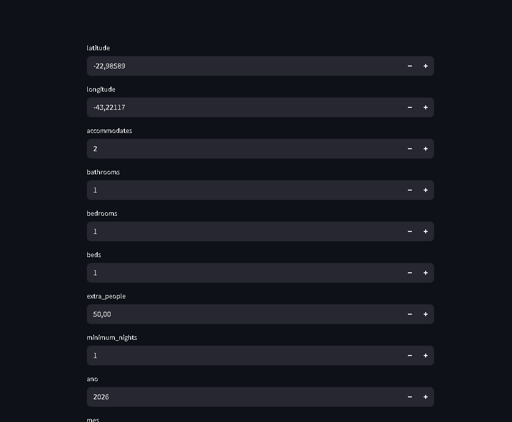
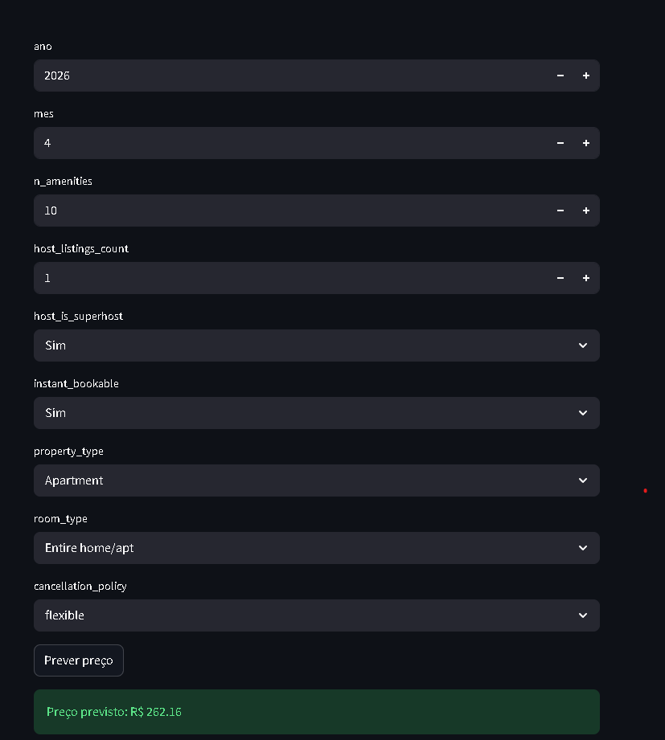

# 🏠 Airbnb Price Predictor - Rio de Janeiro

## 📌 Sobre o Projeto

Aplicação de Machine Learning para previsão de preços de imóveis no Airbnb no Rio de Janeiro.

O modelo analisa características como localização, tipo de imóvel e capacidade para estimar o valor ideal da diária.

---

## 📸 Demonstração




---

## 🚀 Tecnologias

- Python
- Pandas
- Scikit-learn
- Streamlit

---

## 🧠 Modelo

- Algoritmo:
- Tipo: Regressão

⚙️ Otimização do Modelo para Deploy

Durante o desenvolvimento do projeto, foram testadas versões mais complexas do modelo que apresentaram melhor desempenho preditivo. No entanto, essas versões geravam arquivos muito grandes (na ordem de gigabytes), o que inviabiliza sua utilização em ambientes reais de aplicação.

Plataformas de deploy, como o Streamlit Cloud, possuem limitações de armazenamento, memória e tempo de execução. Modelos muito pesados dificultam o carregamento da aplicação, aumentam o tempo de resposta e podem até impedir a execução do sistema.

Por esse motivo, foi adotada uma versão otimizada do modelo, com redução de complexidade (como limitação de profundidade e número de estimadores), mantendo um bom equilíbrio entre desempenho e eficiência computacional.

Essa decisão reflete uma prática comum no mercado, onde o objetivo não é apenas maximizar a precisão do modelo, mas garantir que ele seja utilizável, escalável e eficiente em ambiente de produção.

Em resumo, o modelo final foi escolhido considerando:

Desempenho preditivo satisfatório
Baixo custo computacional
Facilidade de deploy e uso em aplicações reais

---

## 📊 Dataset

Baixe o dataset em:
https://www.kaggle.com/allanbruno/airbnb-rio-de-janeiro

Após baixar:

1. Coloque o arquivo `.csv` dentro do dataset e apague o readme.md depois

---

## ⚙️ Como executar

```bash
git clone https://github.com/seu-usuario/airbnb-price-predictor.git
cd airbnb-price-predictor

python -m venv venv
venv\Scripts\activate

pip install -r requirements.txt
```

---

## ▶️ Executar aplicação

```bash
streamlit run app.py
```

---

## ⚠️ Observações importantes

- Certifique-se de que os dados estão nas pastas corretas (`data/`, `dados_tratado/`)
- O modelo precisa estar na pasta `models/`
- Caso contrário, a aplicação não funcionará corretamente

---

## 💡 Funcionalidades

- Previsão de preço em tempo real
- Interface interativa com Streamlit
- Tratamento de variáveis categóricas

---

## 🚀 Próximos passos

- Deploy em nuvem
- Criação de API com Django REST Framework
- Otimização do modelo

---

## 👨‍💻 Autor

Guilherme
